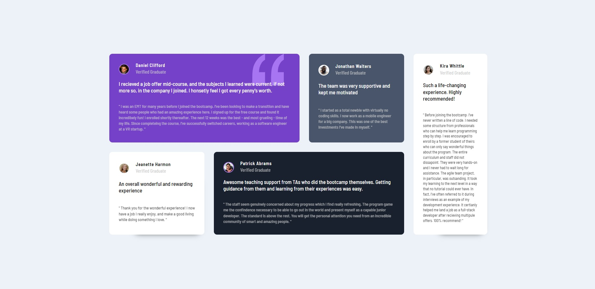

- Overview:
  - [Testimonials Grid Section](#the-challenge)
  - [https://wella4life.github.io/Challenge_1_Medium/](#links)
  - 
  - 

 - Users should be able to:
   - View the optimal layout for the site depending on their device's screen size

 - What I Learned:
   - Grid can do almost anything
   - Some challenges are heavily focused on html more than css
   - Double naming divs help in seperating their needs while sharing common goals
   - Check Desktop AND Mobile design before starting, might help
 
 - What I Couldn't Do:
   - I understood how its done, but the size and dimensions were off by a little
   - I understood how its done, but the box shadow was a little off
